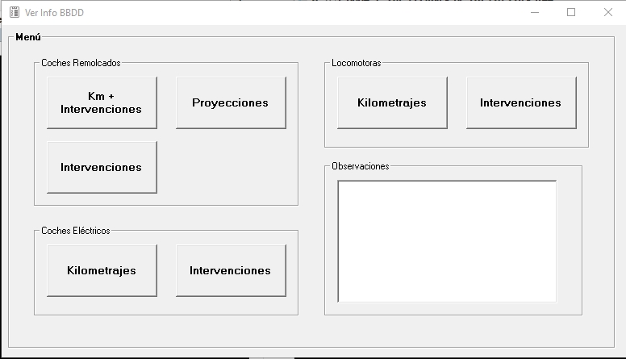

# ProyeccionKm-MTF-CNR
Sistema de Proyección de Kilometraje - Flota Materfer & CNR

## Descripción

Sistema desarrollado en Visual Basic 6 para la gestión y proyección de kilometraje del Material Rodante ferroviario de las flotas Materfer y CNR. El software accede a bases de datos Microsoft Access 2.0 existentes y proporciona herramientas para el seguimiento, análisis y proyección del mantenimiento de los vehículos.

## Características Principales

### 📊 Proyección de Kilometraje (Módulo Principal)
El formulario estrella del sistema calcula y visualiza la proyección de kilometraje de cada unidad, mostrando:
- Kilometros recorridos desde las últimas reparaciones pesadas más importantes
- Grilla visual con código de colores que indica cuando se superan los umbrales de kilometraje desde cada tipo de reparación pesada
- Alertas automáticas para planificación de mantenimiento preventivo

### 🚆 Consulta de Material Rodante
- **Coches de Cercanías y Larga Distancia (CCRR)**: Consulta de kilometraje e intervenciones
- **Coches Eléctricos (CCEE)**: Seguimiento de mantenimiento de material eléctrico
- **Locomotoras**: Gestión de información de locomotoras

### 📈 Informes y Análisis
- Consulta de kilometraje recorrido entre fechas específicas
- Historial detallado de intervenciones realizadas sobre cada vehículo
- Ficha completa con todos los datos importantes de cada unidad
- Exportación de datos a Microsoft Excel

### 🔍 Navegación
Interfaz intuitiva con menú principal que permite acceder a:
- Bases de datos de diferentes tipos de material rodante
- Consultas de kilometraje y proyecciones
- Registro de intervenciones
- Informes consolidados

## Requisitos del Sistema

### Software Necesario
- **Windows** (recomendado Windows 7 o superior)
- **Visual Basic 6.0 Runtime** (para ejecutar la aplicación)
- **Microsoft Access 2.0** o controladores compatibles (MDAC)
- **Controles OCX requeridos**:
  - `MSFLXGRD.OCX` - Microsoft FlexGrid Control (visualización de grillas)
  - `MSHFLXGD.OCX` - Microsoft Hierarchical FlexGrid Control

> **Nota**: Los archivos `.ocx` no están incluidos en el repositorio (ver `.gitignore`) ya que deben instalarse en el sistema. Estos controles suelen estar disponibles en las instalaciones de Visual Basic 6.0 o pueden descargarse de repositorios de componentes VB6.

### Bases de Datos
El sistema trabaja con tres bases de datos Microsoft Access:
- `baseCCEE.mdb` - Coches Eléctricos
- `baseCCRR.mdb` - Coches de Cercanías y Larga Distancia
- `baseLocs.mdb` - Locomotoras

> **Nota**: Las bases de datos (`.mdb`) están excluidas del repositorio por seguridad y tamaño. Deben configurarse localmente según el entorno de producción.

## Instalación

1. **Instalar Visual Basic 6.0 Runtime** si no está instalado
2. **Registrar los controles OCX**:
   ```cmd
   regsvr32 MSFLXGRD.OCX
   regsvr32 MSHFLXGD.OCX
   ```
3. **Configurar las bases de datos** Access en las rutas correspondientes
4. **Ejecutar** el proyecto abriendo `Info_JMN.vbp` en Visual Basic 6.0

## Estructura del Proyecto

- **FormMenu.frm**: Menú principal de navegación
- **ConsKmCCRRCPG.frm**: Formulario principal de proyección de kilometraje
- **IntCCRR.frm / IntCCEE.frm / IntLocs.frm**: Consultas de intervenciones
- **AbrirBaseCCRR.frm / AbrirBaseCCEE.frm / AbrirBaseLocs.frm**: Gestión de conexiones a bases de datos
- **Info_JMN.vbp**: Archivo de proyecto Visual Basic

## Capturas de Pantalla

### Menú Principal
Interfaz de navegación principal del sistema con acceso a todos los módulos.



### Proyección de Kilometraje - Vista Principal
Visualización de la proyección de kilometraje con grilla codificada por colores según los umbrales de mantenimiento.


### Consultas y Análisis
Diferentes vistas del sistema mostrando consultas de kilometraje, intervenciones y datos del material rodante.


## Mantenimiento y Desarrollo
Este proyecto está diseñado para facilitar la planificación del mantenimiento del Material Rodante mediante:
- Seguimiento histórico preciso
- Proyecciones basadas en kilometraje real
- Alertas visuales para mantenimiento preventivo
- Reducción de tiempos de inactividad no planificados

## Licencia
[Privada]
